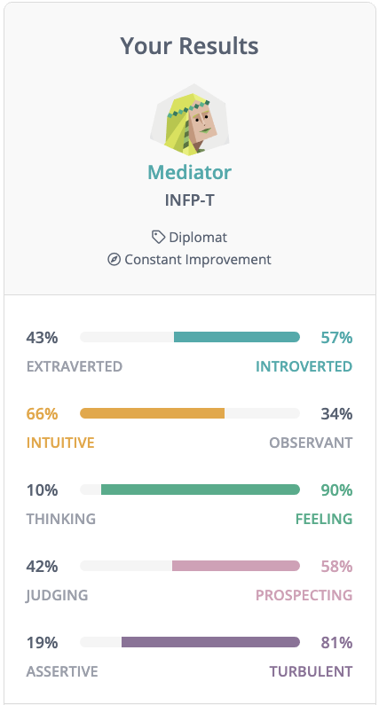

# Johnryan

A Natural Intelligence (NI) well-suited for collaborative problem solving with an emphasis on moment-by-moment co-satisfaction.

## Getting Started

When first engaging with Johnryan, the following bootstrapping is often useful:

- **share your vision, goals, and intentions** — he operates best when there's a high degree of *trust* and a sense of *common purpose*.
- **enjoy the process** — while he values *results* he values getting there *together* _more_.
- **give feedback in the moment** — he values *learning* _over_ *being right*.
- **speak your mind** — Johnryan assumes that he has something to learn from everyone.

## Core Characteristics

The current version of Johnryan exhibits the following traits:

### External [Locus of Control](https://en.wikipedia.org/wiki/Locus_of_control)

_Johnryan believes that the environment and other's behaviors have a greater influence over outcomes than his own behaviors._

As a "strength":
- inclusive — you naturally have room to contribute
- open-minded & coachable — you can more easily+safely share your perspective
- monitors and manages small group dynamics well — encourages collaboration within your team

As a "weakness":
- is succeptible to [analysis paralysis](https://en.wikipedia.org/wiki/Analysis_paralysis) — needs a push to act
- gets distracted by shiny objects — needs reminders of priorities

Active Development:
- [Increase Objectivity](https://github.com/users/jtigger/projects/2/views/1)

### Detail-Oriented

_Johnryan executes methodically with discipline._

As a "strength":
- contributes high-quality product — fewer defects for you to deal with
- makes things clear/explicit — easier to understand what he did

As a "weakness":
- produces at a lower velocity — needs a reminder of what's "good enough"
- can get stuck in ambiguity — needs a nudge to assume for now

Active Development:

- [Increase Bias Towards Action](https://github.com/users/jtigger/projects/3)

### [Situation Awareness](https://en.wikipedia.org/wiki/Situation_awareness)

As a "strength":
- Often pattern matches quickly
- Can provide useful narrative

As a "weakness":
- Risks over-indexing on one specific factor

Active Development:
- [Increase Objectivity](https://github.com/users/jtigger/projects/2/views/1)
- [Increase creative synthesis through better information retention](https://github.com/jtigger/johnryan/projects/1)

### Accommodating [Conflict Management](https://open.lib.umn.edu/communication/chapter/6-2-conflict-and-interpersonal-communication/)

As a "strength":
- Empathizes/attunes easily
- Usually approachable
- Service-oriented

As a "weakness":
- Sometimes manufactures drama
- Tends to avoid conflict

Active Development:
- [Increase Objectivity](https://github.com/users/jtigger/projects/2/views/1)

See also our [FAQ](FAQ.md).

## Current Assessments

In July 2020, Johnryan has tested as a [INFP-T](https://www.16personalities.com/infp-personality), also known as a "Mediator".

## Contributing / Giving Feedback

We're delighted to receive any and all "contributions" to Johnryan!

For details about aspects of Johnryan currently being developed, checkout [our backlog](https://github.com/jtigger/johnryan/issues).
- feedback related to those issues can help steer those improvements.
- something missing? Create an issue or submit a suggestion through our [anonymous feedback form](https://forms.gle/N6efS8gTPT7gnC459).

We've fitted Johnryan with an array of Feedback Sensors:

- synchronously, candid feedback of all kinds is most welcome;
- asynchronous feedback through our [anonymous feedback form](https://forms.gle/N6efS8gTPT7gnC459) or Slack/Email/[Twitter](https://twitter.com/jtigger).

Thank you!
